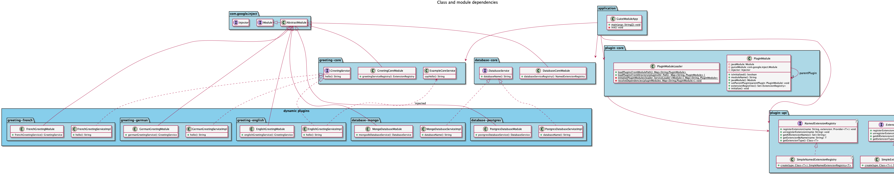

# Guice Java Module Plugin example

This example project exposes [Guice](https://github.com/google/guice) dependency injection modules together with Java modules [JPMS/Java Platform Modukle System](https://en.wikipedia.org/wiki/Java_Platform_Module_System) in order to create a modular application, which even supports extending defined service interfaces.

This simple approach does need only one interface `ExtensionRegistry` with already provided default implementation `SimpleExtensionRegistry` which is only needed by the plugin defining the extension point. Any interface or class can be defined as contract to be implemented by additional plugins.

The general idea is to expose Guice module definitions as java service as explained in the article [https://www.oreilly.com/content/handling-dependency-injection-using-java9-modularity/](Handling dependency injection using Java 9 modularity). A plugin just needs to define its Guice module class as java service
```
  provides com.google.inject.Module
    with de.vagtsi.examples.guicejavamodule.greeting.english.EnglishGreetingModule;
```
 in order to get loaded by the application core implementation on startup
 ```
  ServiceLoader<Module> pluginLoader = ServiceLoader.load(com.google.inject.Module.class);
 ```
 
Additionally this example creates one `Injector` instance for each module/plugin. In case of parent module dependencies defined by `requires` within the `module-info.java`, the `Injector` is created as child injector of that parent module in order to access any provided instances via `@Inject`. Extension services just need to be provided in their Guice module
```
  @ProvidesIntoSet
  @Singleton
  public GreetingService englishGreetingService() {
    return new EnglishGreetingServiceImpl();
  }
```
to get automatically registered at the appropriate `ExtensionRegistry`.



## Compile and run
Just compile and execute the configured application with the provided gradle wrapper on the command line:
```
./gradlew run
```
The application will show nice logging output to the stdout to get some insights of the module mechanism.

To import the source code into the Eclipse IDE you can create the necessary `.project` and `.classpath` files with 
```
./gradlew eclipse
```
and the `Import/Existing Projects into Workspace` with `Search for nested projects` option switched `on` within Eclipse.
